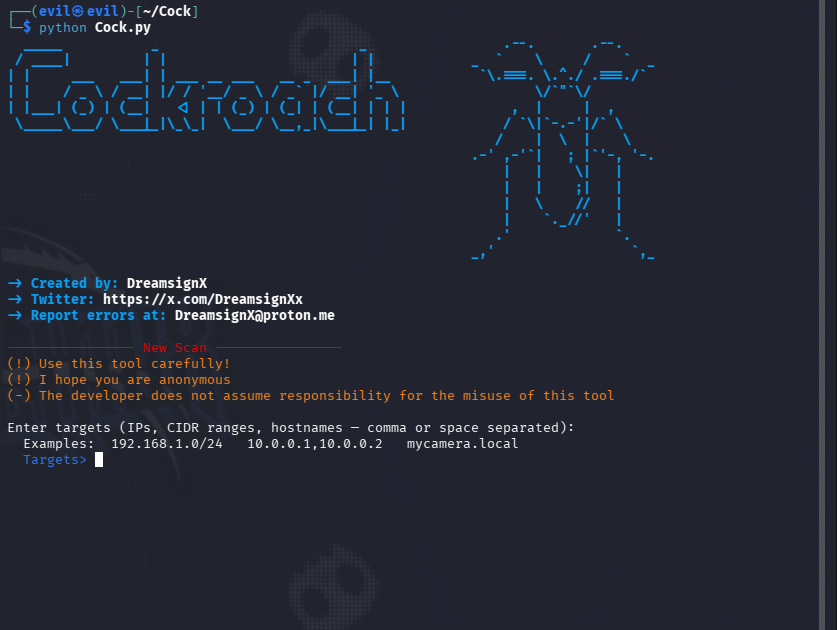

Cockroach is a python3 ip camera scanner and LAN vulnerability finder that has hosted cameras.
Combining Cockroach with nmap can archieve an acurate an complete scan.
_______________________________________________________________________________________________

What can Cockroach do?

Cockroach normally try detect IP camera web interfaces DVR/NVR, RTSP (port 554) ONVIF, Well-known manufacturers: Hikvision, Dahua, Reolink, Tapo or Axis
When the tool does not find hosted IP cameras, but does find a vulnerable router, it reports it anyway.
(!) The tool was not made for either ethical or malicious uses, it just a simple friendly scanner like nmap
but more easy, So thats mean the tool can be used for malicious action including reconnaissance without permission
and discovery of vulnerabilities such as weak passwords or open ports on a Ip, If no camera service is found the tool will simply display the message "Camera not found"
and it will search for vulns aditionally.
________________________________________________________________________________________________________________________________________________________________________

Installation:

(1) git clone https://github.com/dreamsignX/Cockroach-cameras.git

(2) cd Cockroach-cameras

(3) python3 Cock.py
___________________________________________________________________________

Cockroach Scan example.

-firts open nmap and scan target

nmap -sV 192.168.0.0/16

It will show common ports and scanned ip LAN.

Example: Nmap scan report for 192.168.X.XX

(.) Now you can python/python3 Cock.py

Put the target ip (192.168.X.XX)
(!) and it will scan sucessfull, (if camera not found, it will show "cameras: 0"
(!) Make sure put a camera IP to scan.

